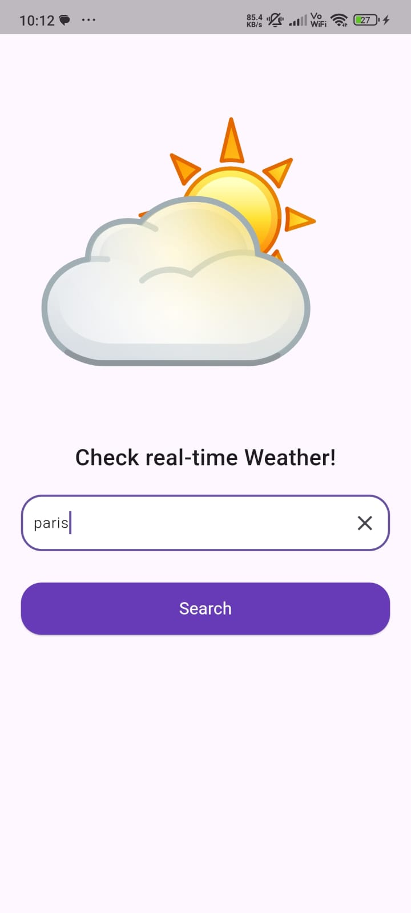
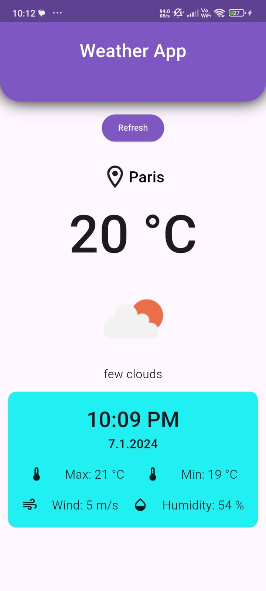
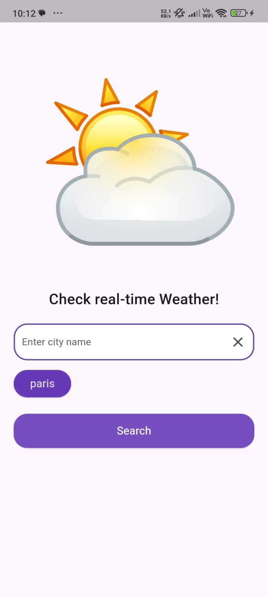

# Weather App

Welcome to the Weather App, a simple Flutter application to check real-time weather conditions for cities.

## Features

- Check real-time weather for any city.
- Persistently save and retrieve the last searched city.
- Clean UI for easy navigation and interaction.

## Installation

To run the app locally, ensure you have Flutter installed. If not, follow the [Flutter installation guide](https://flutter.dev/docs/get-started/install).

### Steps to Run:

1. **Clone Repository:**
   ```bash
   git clone [https://github.com/TheDevKaran/Assignment.git]
   cd weather_app/
   ```

2. **Install Dependencies:**
   ```bash
   flutter pub get
   ```

3. **Run the App:**
   - Connect your device or start an emulator.
   ```bash
   flutter run
   ```

## Usage

- Enter a city name in the search bar and press "Search" to view its weather details.
- The last searched city is saved persistently and displayed as a button below the search bar for quick access.

## Screenshots





## Contributing

Contributions are welcome! Fork the repository and submit a pull request for any enhancements or bug fixes.

## License

This project is licensed under the MIT License - see the [LICENSE](LICENSE) file for details.

## Acknowledgments

- Weather data provided by [OpenWeather](https://openweathermap.org/api)

---

### Additional Notes

- Customize the app's theme, colors, and animations as per your requirements in `lib/screens/welcome_screen.dart` and `lib/scrrens/homescreen.dart`.
- For any issues or suggestions, please open an [issue](https://github.com/TheDevKaran/weather_app/issues).

Feel free to expand this README with more details specific to your project or update it as your project evolves.
